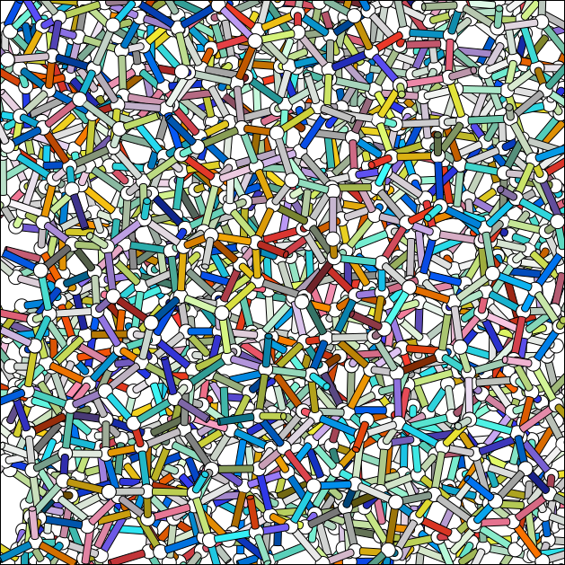

```shell
genice2 CRN1 -f twist[svg] > sample.svg
```

# [{{package}}]({{url}})

{{summary}}

version {{version}}

## Requirements


* {{i}}


## Installation from PyPI

```shell
% pip install {{package}}
```

## Manual Installation

### System-wide installation

```shell
% make install
```

### Private installation

Copy the files in {{base}}/formats/ into your local formats/ folder.


## Usage


    {{usage}}



## Auxiliary Files

* IhST2.twhist
* IcST2.twhist
* LDLST2.twhist
* HDLST2.twhist

They are two-dimensional (i.e. real and imaginary) histograms of twist order parameter of ST2 water at 235 K, 0.98 g cm<sup>-3</sup>. You have to prepare the appropriate histogram if you want to apply CM (color-mixing) or DB (decision-boundary) coloring scheme to other water models or in other conditions.

## Test in place

```shell
% make test
```

## Reference

* Matsumoto, M., Yagasaki, T. & Tanaka, H. A Bayesian approach for identification of ice Ih, ice Ic, high density, and low density liquid water with a torsional order parameter. J. Chem. Phys. 150, 214504 (2019).
